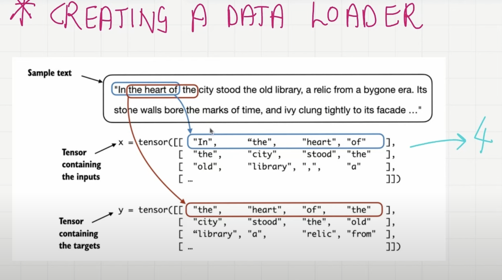

# Lec9  : Create Input Target pairs before Vector Embeddings
    - LLMs learn to predict one word at time
    - LLMs learn [input = LLM , output= learn]
    - LLMs learn to 
    - LLMs learn to predict 
    - LLMs learn to predict one 
    - LLMs learn to predict one word 
    - LLMs learn to predict one word at 
    - LLMs learn to predict one word at time

## Input context length :
    - we learn about this later

## Auto Regressive or Self Learning:
    - whatever the output in first iteration becomes input in next iteration

## Dataset
    - Verdict Dataset its a toy dataset
    - we use BPE tokenizer
    - len(enc_text) --> vocabloury
    - BPE we have tokens as words or subwords or single characters
    - To check we are just removing first 50 tokens from dataset
## How to convert Dataset input out datapairs
    - context size =4  - model is trained to look sequence of 4 words to predict the next word in sequence
    - the first 4 tokens [1,2,3,4] the target next 4 tokens 
    - context size is basically how many words model should pay attention at one time
    - context and desired x = [1,2,3,4] y = [2,3,4,5]
    - context size = no. of prediction task
    - encoded and decoded check

## Structured Manner: Dataloaders for Paralell processing
    - as pytorch tensors we have to do it
    - input tensor and target tensors we need
    - Go to pytorch documents
    - Dataloders that fetches input and output pair  x = [1,2,3,4] y = [2,3,4,5]
    - each row is one input context which is 4 our case so we have 4 prediction task here 
    - **y is input tensor row shifted by 1 position**

## Each input output pair correspond to one prediction task if size of first pair is 4 we have 4 prediction task
    - input and output is sliding
    - return total number of rows

## Class Dataset
    - txt
    - tokenizer : our case BPE
    - Look at picture how loop inside class is in work

    - __getitem__ it will tell data loader what kind of input and output we need
    - we said if we will give index =1 i want input_ids index =1 and target_ids index=1

## Class Dataloaders
    - Batch processing
    - droplast=true. we will learn about this later
    - Dataloader check getitem method in dataset class and return what input and output are formatted
    - help us parallel processing
    - num_workers number of  processing used
    - itr and next method give input and output pair
    - Batch size=4 and stride =4  checking
    why increase stride=4
        - utilise data fully without overlapping it is used to avoid overfitting
        - no overlap between batch 1 and batch 2